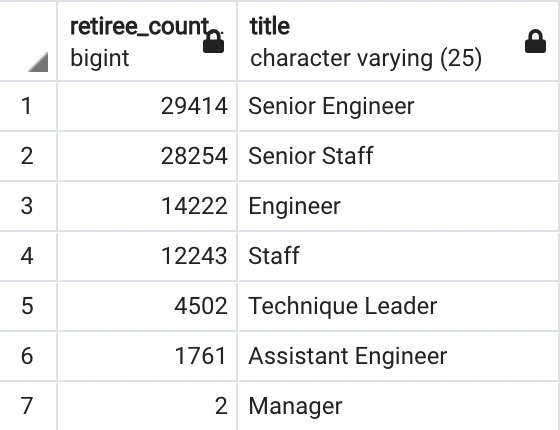
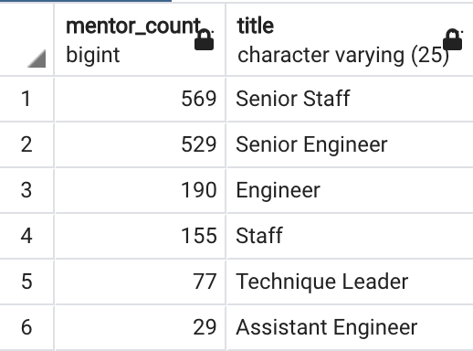

# Pewlett-Hackard-Analysis

## Overview of the analysis

This analysis takes an inventory of all current employees to identify how many positions will be turning over and to help Pewlett-Hackard train and prepare their workforce to handle the company's future staffing needs.

## Results

### More than a third of active employees set to retire
 * With 240,125 active employees, more than thirty-seven percent of Pewlett-Hackard's workforce is about to retire.
 
### Number of retiring employees needing to be replaced
 * More than 90,000 employees are coming to retirement age in the coming few years at Pewlett-Hackard.

  

### Insufficient mentor candidates in the client's original target set
 * Pewlett-Hackard is considering starting a mentorship program, rolled out with current employees born in 1965, to train up the new generation of employees so that they are ready to replace those who are retiring, but there are only about 1,500 current employees in that pool of mentor candidates.

 

### More than enough mentor candidates are available when the set is expanded
 * There are 166,118 current employees born between 1956 and 1964. In other words, the pool of employees just shy of retirement age and just over the mentorship target age is large enough to easily provide the mentor group needed to bring a group of 90,000 new hires up to speed as the 1952-1955 group begins to retire.

## Summary

* There are 90,398 roles that need to be filled as the "silver tsunami" begins to make an impact.

* The mentorship pilot program being considered by the company is not large enough to prepare the next generation for senior leadership positions. The pool of mentors would need to be expanded roughly 60-fold to create a one-on-one mentorship program to replace retiring workers. 
